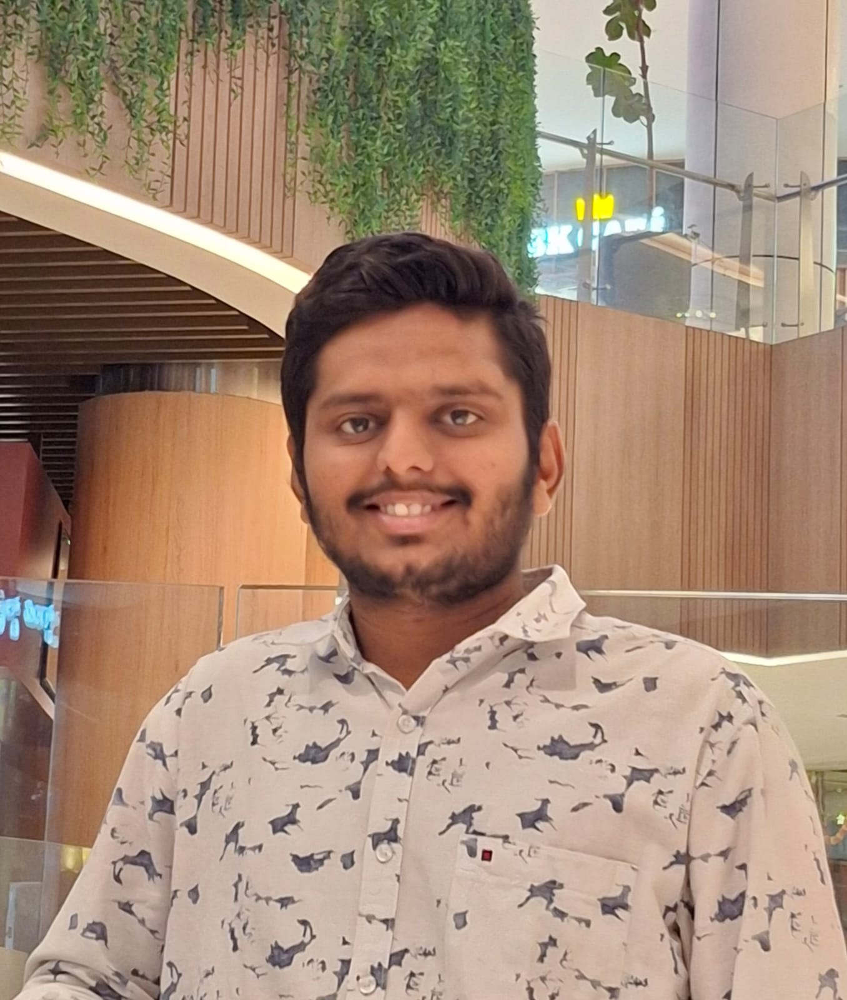

<h1 align="center">Hi 👋, I'm Kshitijh Agarwal</h1>
<h3 align="center">Java developer strengthening fundamentals through DSA and backend development</h3>

---

### 👨‍💻 About Me

- 💼 Full Stack Developer Intern  
- 🌱 Currently working with **Java, DSA, and backend development**
- 🧠 Focused on building strong fundamentals through problem-solving and real projects
- ⚙️ Interested in writing clean, readable, and scalable code
- 📫 Reach me on LinkedIn

---

### 🛠 Tech Stack

**Languages**
- Java
- Python
- SQL

**Frontend**
- HTML
- CSS
- JavaScript
- React.js

**Backend**
- Java (Core)
- Django
- MySQL

**Tools**
- Git & GitHub

---

### 📊 GitHub Stats

  

  

---

### 🔗 Connect with Me

- LinkedIn: https://www.linkedin.com/in/kshitijh-agarwal/

---

> Building skills step by step.  
> Learning through consistency, not shortcuts.
